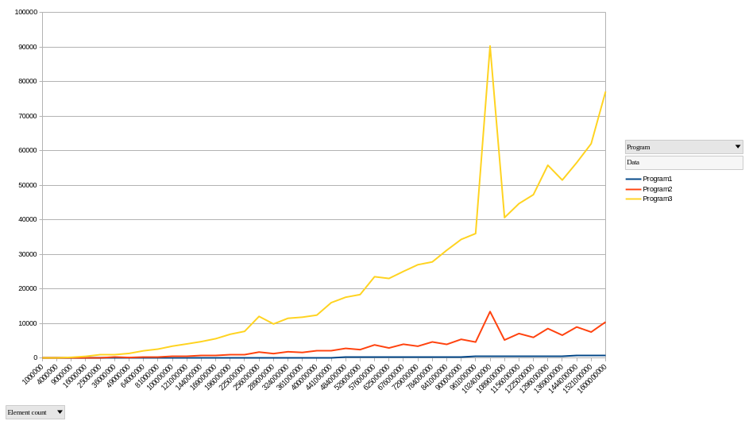

This rust code is inspired by David May's talk '[Commodity High Performance Computing](http://people.cs.bris.ac.uk/~dave/benhpc.pdf)' from 2007.

On slides 9, 10, and 11 he lays out three simple programs for creating an array, and summing the values within that array. 

The aim of these programs is to demonstrate how little most programmers understand about the details of the hardware they are using - and how their programming language of choice is being implemented.

In this particular implementation of the three programs I have focused on creating code that differs as little as possible between the three versions:

**Data**
For each program a two dimensional data structure is implemented using a linear Vec. There are a equal number of columns as there are rows (square). The values in each row are equal to the row index e.g. for a 4x4 grid:

| 0   | 0   | 0   | 0   |
| --- | --- | --- | --- |
| 1   | 1   | 1   | 1   |
| 2   | 2   | 2   | 2   |
| 3   | 3   | 3   | 3   |

**Program1**
- An outer loop iterates the ***rows***
- An inner loop iterates the ***columns***
- The value is extracted from the table and accumulated in a sum
- The column counter is incremented, as required.
This program is typically very highly optimized.

**Program2**
- An outer loop iterates the ***columns***
- An inner loop iterates the ***rows***
- The value is extracted from the table and accumulated in a sum
- The row counter is incremented, as required.
This program may run ~10x slower than Program1 (in release mode) for large data structures.

**Program3**
- An outer loop iterates the ***columns***
- An inner loop iterates the ***rows***
- The value is extracted from the table and accumulated in a sum
- The row counter use the extracted value + 1, as required.
This program may run ~100x slower than Program1 (in release mode) for large data structures.

**Example results**
- X-axis: total element count
- Y-axis: time to process in ms

